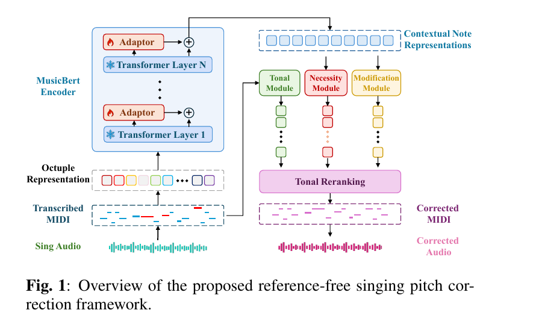

# Reference-Free Singing Pitch Correction via Music-Constrained Sequence Editing

[Interactive demo](https://dongb001.github.io/RSPC-MSE/) · ICASSP manuscript

## Overview

Singing pitch correction improves amateur vocal performances, but most existing systems depend on a target melody, an accompaniment track, a known key, or another external reference. Such information is often unavailable in open-world applications. This work instead formulates **reference-free singing pitch correction** as a music-constrained sequence-editing problem: the model must decide both whether a note should be changed and how its pitch should be corrected.

The proposed framework combines singing-context representation learning, hierarchical edit prediction, and tonal constraints. It detects note-level pitch errors, predicts pitch offsets, and uses musical context to guide correction while preserving notes that are already correct.

## Method

- **Singing-aware context:** a pretrained symbolic-music encoder is adapted to singing data to model note sequences in musical context.
- **Hierarchical editing:** note-level error detection and pitch-offset prediction are learned jointly, separating the decision to edit from the correction itself.
- **Tonal guidance:** music-theoretic key information constrains candidate corrections without requiring a reference melody or accompaniment.



## Results

On the held-out real-singing test set, the proposed method raises note-level exact-pitch accuracy from **73.25%** to **83.43%**. It improves accuracy by **3.99 percentage points** over the context-based BERT-APC baseline while balancing error repair against unwanted changes to correct notes.

| Method | Accuracy ↑ | Δ Accuracy ↑ | Error repair ↑ | Harm ↓ |
|---|---:|---:|---:|---:|
| Input | 73.25 | 0.00 | – | – |
| Key Snapping | 71.76 | -1.49 | 20.76 | 9.62 |
| BERT-APC | 79.44 | +6.19 | 26.18 | 1.11 |
| **Proposed method** | **83.43** | **+10.18** | **46.81** | **3.19** |

Here, *Error repair* is the percentage of inaccurate notes corrected, and *Harm* is the percentage of originally correct notes that were changed.

## Listening Demo

The interactive page provides five curated examples. Each example contains four aligned 8-second clips:

- the original singing performance;
- the proposed adaptor-and-tonality method;
- the BERT-APC context baseline; and
- the Key Snapping tonal baseline.

Each excerpt is paired with discrete MIDI-pitch and continuous mapped-F0 visualizations. The examples are aligned comparisons rather than a random evaluation sample, and the repository does not include a confirmed reference-original waveform.

## Repository Contents

- `index.html`, `styles.css`, `app.js`: bilingual interactive project page;
- `audio_clip/`: aligned listening examples;
- `figures/`: MIDI-pitch and mapped-F0 comparisons;
- `data/samples.json`: sample metadata; and
- `paper/model_overview.png`: method overview.

Audio reconstruction outside this demo depends on additional processing components, including SOME, pitch modification, and NSF-HiFi-GAN.

## Citation

Author names, affiliations, and the final bibliographic record will be added when the manuscript metadata is finalized.

```text
Reference-Free Singing Pitch Correction via Music-Constrained Sequence Editing.
ICASSP manuscript.
```
